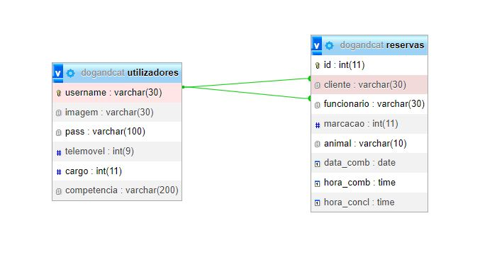
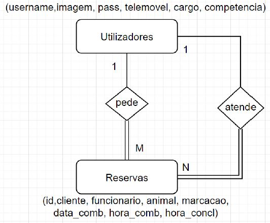
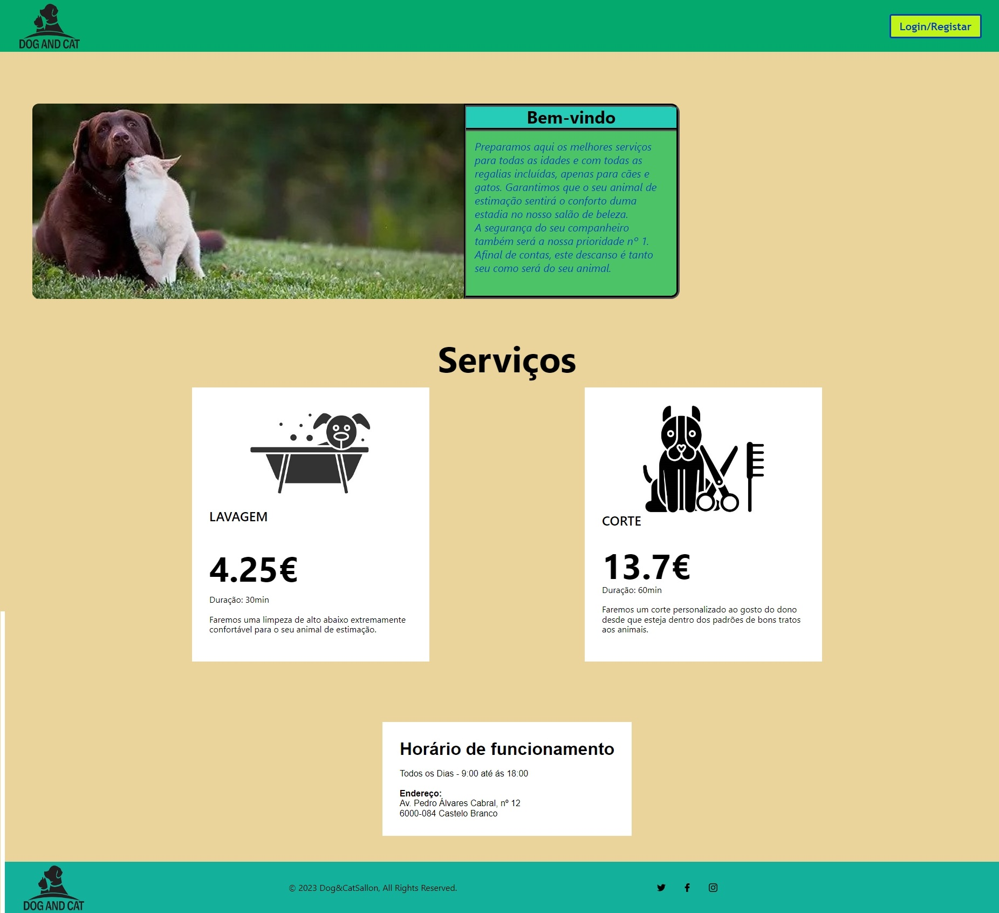
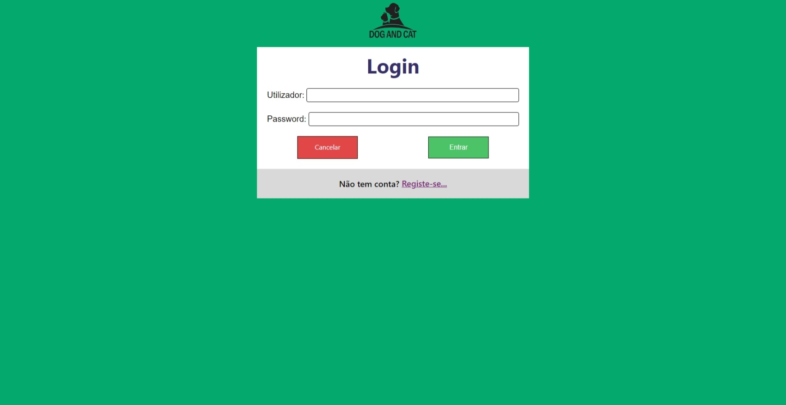
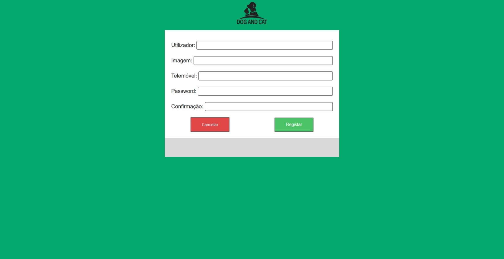
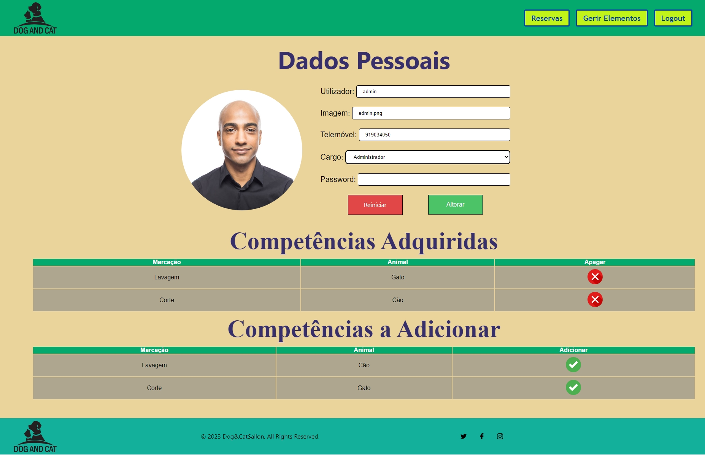
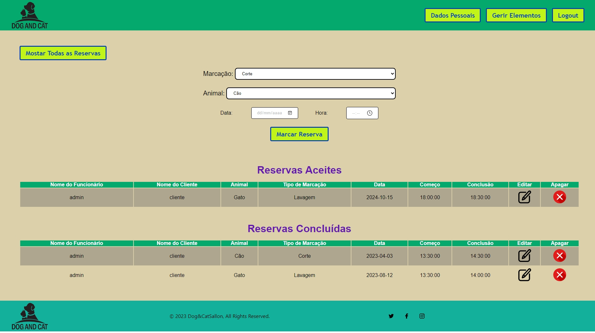
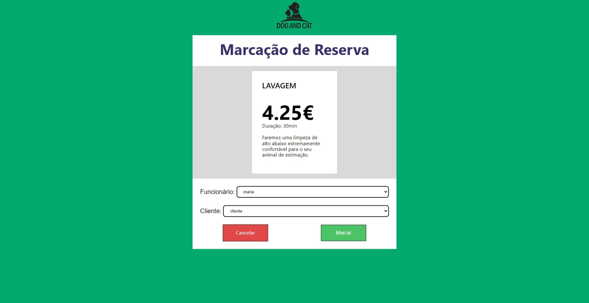
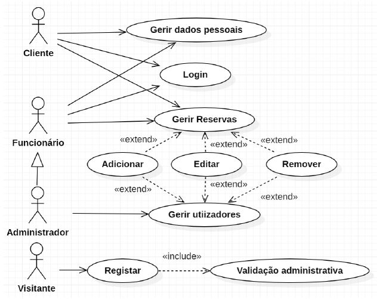

# Website Dog and Cat (PHP)
Projeto PHP que realiza serviços veterinários para cães e gatos

Desenvolvemos um website para uma clínica de cães e gatos utilizando PHP e HTML. O site permite que os clientes façam compromissos, os funcionários aceitem e os administradores gerenciem os utilizadores. Os administradores podem aceitar visitantes como clientes, remover clientes ou funcionários, alterar dados (com restrições) e criar novas contas de funcionários. Cada página do site possui proteções que verificam a posição do utilizador, sua finalidade e se ele está logado, para evitar o acesso não autorizado.

## Modelo Relacional da Base de Dados
O resultado deste modelo relacional é o seguinte:

Reservas: id(PK), cliente(FK), funcionario(FK), animal, marcacao, data_comb, hora_comb, hora_concl

Utilizadores: username(PK), imagem, pass, telemovel, cargo, competencia

Com este modelo, mantemos a tabela **Utilizadores** com a distinção entre utilizadores através do atributo username e a distinção entre cargos com o atributo cargo, definido através do código.

Na tabela **Reservas**, definimos um identificador que incrementa automaticamente, o cliente que solicitou a reserva, o animal e o tipo de marcação pretendida (corte, lavagem, etc.), a data e hora de início, bem como a hora prevista de conclusão (baseada na duração da marcação definida em código).

    
    

## Páginas
### Página Inicial
A página inicial apresenta a empresa e informa os utilizadores sobre os serviços oferecidos. Inicialmente, há um botão para login, e após o login, botões de navegação para outras páginas são disponibilizados de acordo com a posição do utilizador. A navegação é consistente no funcionamento e aparência em todo o site.

### Formulário de Login
O formulário de login possui campos para o nome de utilizador e a senha, enviados para verificação ao clicar em "Entrar". Há opções de "Cancelar" para voltar à página inicial e um link para o formulário de registro.

### Formulário de Inscrição
O formulário de inscrição pede dados essenciais, como nome de utilizador e palavra-passe. Após verificar e confirmar a ausência de duplicatas, os dados são registrados. A posição inicial é "visitante" ou outra definida pelo administrador. "Cancelar" retorna o utilizador para login ou gerenciamento de utilizadores.

### Página de Dados Pessoais
Esta página permite ao utilizador visualizar e alterar os seus dados, de acordo com a sua posição. Os administradores têm acesso a tabelas adicionais para gerir competências e reservas associadas. O botão "Reiniciar" restaura os valores anteriores e "Alterar" salva as alterações.

### Página de Reservas
A página de reserva tem um formulário para o tipo de consulta, tipo de animal, data e hora. Depois de enviar as informações, uma tabela de "Reservas Aceitas" e uma tabela de "Reservas Concluídas" são exibidas. Os administradores podem alternar entre os modos de visualização.

### Formulário de Marcação de Reservas
Este formulário permite-lhe escolher o funcionário e cliente (se aplicável) para a reserva, validando a informação para garantir a compatibilidade com horários e competências. "Cancelar" devolve o utilizador à página de reserva.

## Diagrama de Casos de Uso

